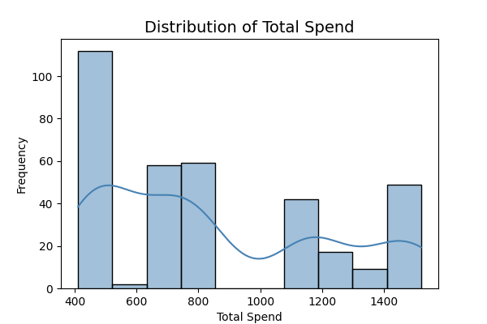
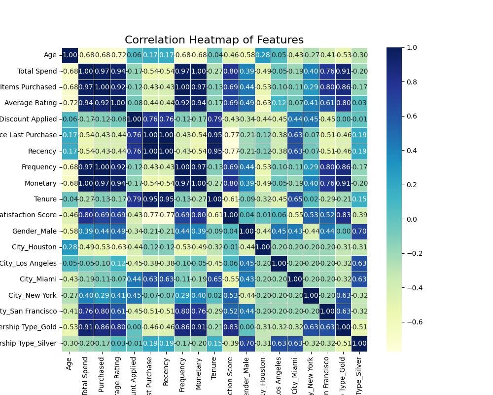
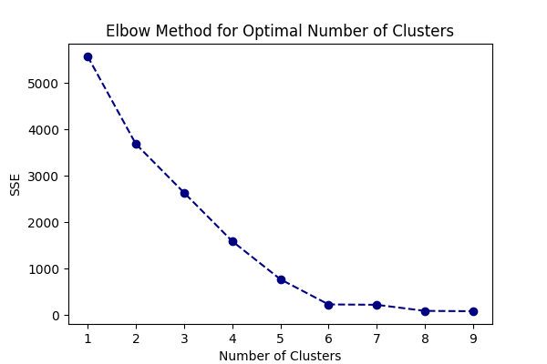

# 🛍️ E-Commerce AI Driven Customer Segmentation Capstone Project

## 📌 Problem Statement

E-commerce platforms often struggle with broad, ineffective marketing campaigns that waste resources and fail to engage customers personally. 
This project addresses that challenge by identifying meaningful customer segments using real-world data.

---

## 🎯 Goal

Develop a **AI driven customer segmentation model** using behavioral and demographic data to:
- Improve marketing ROI
- Personalize campaigns
- Retain high-value customers
- Understand purchasing patterns

---

## 📂 Data Sources

- **E-commerce_Customer_Behavior.csv**  
  Includes:
  - **Demographics**: Age, Gender, City, Membership Type
  - **Purchases**: Total Spend, Items Purchased, Discounts Used
  - **Engagement**: Days Since Last Purchase, Satisfaction Level
  - **Ratings**: Average Product Ratings

<details>
<summary>Sample Data Preview</summary>

| CustomerID | Age | Gender | City | MembershipType | TotalSpend | ItemsPurchased | DiscountsUsed | DaysSinceLastPurchase | SatisfactionLevel | AvgProductRating |
|------------|-----|--------|------|---------------|------------|----------------|---------------|----------------------|-------------------|------------------|
| 1001       | 29  | F      | NYC  | Gold          | 1500       | 12             | 2             | 10                   | 4.5               | 4.6              |
| 1002       | 42  | M      | LA   | Silver        | 800        | 6              | 1             | 34                   | 3.8               | 4.1              |

</details>

---

## 🧹 Data Preparation

- Dropped 2 rows with missing `Satisfaction Level`
- Verified no duplicate rows
- Detected and analyzed outliers (e.g., in spend and item counts)
- Encoded categorical variables (e.g., Gender, Membership Type)
- Standardized numerical features before clustering

---

## 🔍 Exploratory Data Analysis (EDA)

Key Findings:
- Higher `Total Spend` and `Items Purchased` are strongly correlated
- Customers with higher `Average Ratings` and satisfaction tend to spend more
- Discount usage patterns vary by age and membership type

**Visualizations:**

| Distribution of Total Spend | Correlation Heatmap |
|----------------------------|---------------------|
|  |  |

- Histograms, boxplots, and heatmaps revealed variable distributions and correlations

---

## ⚙️ Feature Engineering

Created additional insights:
- Encoded categorical variables
- Scaled features for clustering
- Prepared a cluster-friendly dataset with key variables: Total Spend, Items Purchased, Satisfaction Level, etc.

---

## 🔢 Clustering & Segmentation

Used **K-Means** clustering to identify customer groups.

- **Optimal Clusters:** 4  
  Validated using:
  - **Elbow Method:**  
    
  - **Silhouette Score:**  
    Silhouette Score: 0.5930051416003562

### 📦 Customer Segments

| Cluster | Label                            | Key Traits                                   |
|--------:|----------------------------------|----------------------------------------------|
| 0       | Discount-Driven Occasional Shoppers | Older, mid-spenders, use discounts often   |
| 1       | Young Bargain Hunters            | Very active, high spend, rely on discounts   |
| 2       | Moderate Loyal Customers         | High satisfaction, steady spend, low discounts |
| 3       | High-Value Frequent Buyers       | Big spenders, very loyal, no discounts       |

**Cluster Visualizations:**
- 
- 

---

## 🤖 Baseline Model

Used **Logistic Regression** to predict cluster membership.

| Metric        | Value |
|---------------|-------|
| Accuracy      | 100%  |
| Precision     | 100%  |
| Recall        | 100%  |
| F1-Score      | 100%  |
| ROC-AUC Score | 1.00  |

✅ Model confirms clusters are **distinct and well-separated**.

---

## 📊 Visualizations and Reports

- Cluster Distribution Pie Chart  
- Silhouette Score vs Cluster Count  
- Heatmap of Cluster Centers  
- Interactive Jupyter Notebooks ([CapstonePart1.ipynb](notebooks/CapstonePart1.ipynb), [CapstonePart2.ipynb](notebooks/CapstonePart2.ipynb))
- [Full HTML Report](reports/customer_segmentation_report.html) (if available)

---

## 💡 Marketing Recommendations

| Segment                | Action                                         |
|------------------------|------------------------------------------------|
| **Occasional Shoppers**| Loyalty programs, win-back campaigns           |
| **Bargain Hunters**    | Flash deals, student discounts, gamified offers|
| **Loyal Moderates**    | Personalized emails, early access              |
| **VIPs**               | Concierge service, exclusive invites, VIP clubs|

---

## ✅ Conclusion

- **Segmentation enables precision marketing**
- High ROI potential via personalized strategies
- Future steps: predict churn, forecast CLTV, integrate real-time behavior

---

## 📎 Files

- `CapstonePart1.ipynb`: Initial EDA, preprocessing, and modeling  
- `CapstonePart2.ipynb`: Advanced clustering, analysis, and recommendations  
- `E-commerce Customer Behavior.csv`: Raw dataset  
- `images/`: All plot images  
- `reports/customer_segmentation_report.html`: Interactive report (optional)  
- `README.md`: This summary

---

## 🛠 Tools Used

- Python (Pandas, Scikit-learn, Matplotlib, Seaborn)
- Jupyter Notebook
- K-Means Clustering
- Logistic Regression

---

### Instructions

1. Clone the repo:
    ```bash
    git clone https://github.com/Jayn412/mlai.git
    ```
2. Install dependencies (`requirements.txt` or notebook cells)
3. View notebooks via Jupyter
4. View images in `images/` and reports in `reports/`

---

Directory structure of the project ➖
=====
/capstone_project_final/
│
├── /data/                        # Directory for dataset(s)
│   └── E-commerce_Customer_Behavior.csv
│        df_features_for_modeling.csv
|        segmentation_summary_df.csv
├── /notebooks/                   # Jupyter notebooks for analysis
│   └── CapstonePart1.ipynb
│       CapstonePart2.ipynb
|       getAIreports.ipynb
├── /reports/                     # Folder for generated reports 
│   └── customersegmentation_report.pdf
|       genAI_Imagereports.png
|       genAI_Imagereports2.png
|       genAI_Imagereports5.png
|       image_summary.html
├── /images/                      #  visualization  images 
│   └── *.png     │
├── /Capstone_AI_Driven_Customer_Segmentation.pdf #problem statement 
├── /NotebookSteps.pdf            # list the order steps followed in notebooks
├── /README.md                    # Summary of findings and link to the notebooks
└── /requirements.txt             #  specific packages or libraries used


Link to notebooks -https://github.com/Jayn412/mlai/blob/capstone_AI_customer_segmentation/capstone_project_final/notebooks/CapstonePart1.ipynb
https://github.com/Jayn412/mlai/blob/capstone_AI_customer_segmentation/capstone_project_final/notebooks/CapstonePart2.ipynb
https://github.com/Jayn412/mlai/blob/capstone_AI_customer_segmentation/capstone_project_final/notebooks/genAIreports.ipynb

This project uses CRISP-DM methodology that includes Business Understanding, Data Understanding, Data Preparation, Modeling, Evaluation, and Deployment. 

Every code cell explains the steps in each module along with the results.

Reports have the detailed explanation on the outcome of some of the code execution part as well as the visualization part. 
